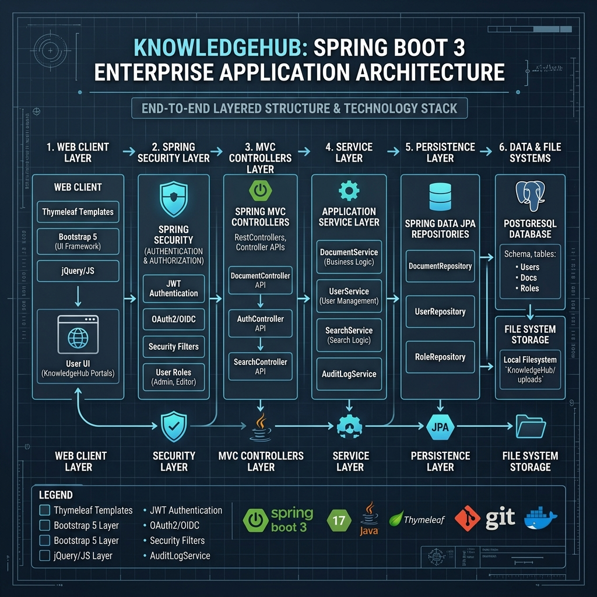
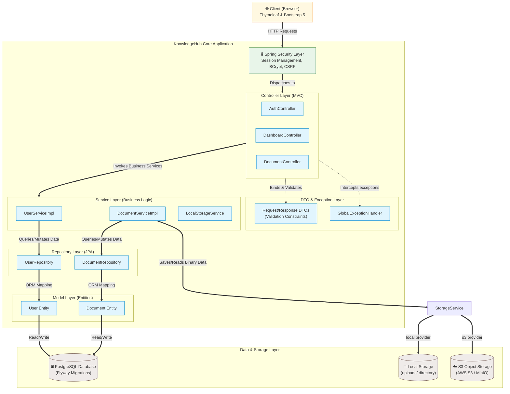

# KnowledgeHub - Enterprise Document Management Portal

KnowledgeHub is a production-quality, enterprise-grade internal knowledge management portal designed for companies to securely upload, organize, search, and download business documents (PDF and DOCX).

The application is built following clean architecture, Spring Boot 3 best practices, and is designed with future enterprise enhancements (e.g., AI document summaries, RAG, Redis caching, S3 storage) in mind.

---

## 🛠 Tech Stack
- **Backend:** Java 21, Spring Boot 3.3.x, Spring Security, Spring Data JPA, Hibernate, PostgreSQL, Flyway, Spring Cloud AWS (S3), Spring Session JDBC, Maven, Actuator
- **Frontend:** Thymeleaf, Bootstrap 5, FontAwesome (UI Icons)
- **Deployment:** Docker, Docker Compose, MinIO (Local S3-compatible Object Storage)

---

## 🚀 Getting Started

### Prerequisites
- Docker & Docker Compose
- *Or* Java 21 & Maven 3.9+ & local PostgreSQL instance running

### Option 1: Run with Docker Compose (Recommended)
Starts the PostgreSQL database and the web application instantly:
1. Create a `.env` file from the example:
   ```bash
   cp .env.example .env
   ```
2. Build and start all services:
   ```bash
   docker compose up --build -d
   ```
3. The application will be running at [http://localhost:8080](http://localhost:8080).

### Option 2: Run Locally (Development)
Build and run the application locally (connects to database on `localhost:5432`):
1. Start the PostgreSQL database container only (or run your local PostgreSQL service):
   ```bash
   docker compose up -d db
   ```
2. Build the package:
   ```bash
   mvn clean package
   ```
3. Run the Spring Boot application:
   ```bash
   mvn spring-boot:run
   ```

---

## 🔑 Access Roles & Authorization
The system supports two core roles:
- **`ADMIN`**: Can view all documents, upload, download, and delete **any** document in the system.
- **`EMPLOYEE`**: Can search, view, and download all company documents, but can **only delete** documents that they personally uploaded.

---

## 📂 Project Architecture

The application is built following clean architecture and Spring Boot 3 best practices, separating concerns into strict layers.

### Visual Architecture Diagram



### Component & Data Flow Diagram (Interactive)



### Layer Descriptions
The project is structured with strict layering:
- `com.enterprise.knowledgehub.model`: Entities (`User`, `Document`, `AuditLog`) and Enums (`Department`, `UserRole`)
- `com.enterprise.knowledgehub.repository`: Repositories (`UserRepository`, `DocumentRepository`, `AuditLogRepository` supporting JPA specifications)
- `com.enterprise.knowledgehub.dto`: Unified request/response data transfer objects with validation constraints
- `com.enterprise.knowledgehub.service`: Interfaces and implementations decoupling storage (`StorageService`), authorization, search filters, statistics, and auditing (`AuditLogService`)
- `com.enterprise.knowledgehub.controller`: Clean MVC controllers for Auth, Dashboard, Document management, Admin audit trails (`AdminController`), and global error handling (`CustomErrorController`)
- `com.enterprise.knowledgehub.exception`: Custom domain exceptions and a `GlobalExceptionHandler` mapping errors to beautiful views

---

## ⚡ Search Scalability & Indexing

To handle searches across hundreds of thousands of files efficiently, the repository utilizes **PostgreSQL Trigram (pg_trgm) indexing**:
- **Substring Wildcards**: Standard B-Tree indexes cannot accelerate queries with leading wildcards (such as `LIKE '%security%'`).
- **GIN Trigram Indexes**: We utilize GIN (Generalized Inverted Index) with `gin_trgm_ops` on the document's `title` and `filename` fields.
- **Performance**: This decreases search lookup times from linear table scans ($O(N)$) to index lookups ($O(\log N)$), ensuring fast searches over high-volume databases.

---


## 📈 Monitoring & Health Check
Spring Boot Actuator health check is available at:
[http://localhost:8080/actuator/health](http://localhost:8080/actuator/health)

---

## 🔒 Security Measures
- **Password Protection:** Encrypted at registration using BCrypt password hashing.
- **Session Protection:** All routes except login/registration and public assets require an active HTTP Session.
- **CSRF:** CSRF tokens are automatically managed and checked by Spring Security for post requests.
- **Delete Authorization:** Enforced programmatically at the service layer preventing employees from deleting documents they do not own.
- **Access Control Restriction:** `/admin/**` endpoints are restricted to the `ADMIN` role, returning HTTP 403 Forbidden to regular employees.
- **Audit Trail Logging:** All core document operations (upload, download, deletion) are audited in a persistent database table (`audit_logs`) for compliance. Deletion audits preserve document titles in log records after data is deleted.

---

## 🔮 Future Architecture & Modular Design
To support upcoming features without breaking the core codebase:
1. **Cloud File Storage (Completed):** Fully integrated via `S3StorageService` implementing the pluggable `StorageService` interface. Easily switch between `local` disk and `s3` (AWS / MinIO) using environment variables.
2. **AI, Virus Scanning & Email Services:** Hooked into Spring's Event System. An event listener can listen to `DocumentUploadedEvent` to process files in the background, run AI summary extractions, index vectors for RAG, execute virus scans, and trigger email alerts.

---

## 🛡️ Production Security & Deployment Configuration

For production deployments, the application enforces database credentials safety using the Spring Boot `prod` profile. 

### 1. Spring Profiles (`default` vs. `prod`)
- **Default Profile (`default`)**: Intended for local development. Standard database fallbacks (`postgres` password, localhost) are active, allowing easy onboarding.
- **Production Profile (`prod`)**: Enforces strict security by disabling fallback values. The application **will fail to start** if database connection parameters are missing from the host environment.

### 2. Running in Production

#### Via Docker Compose (Recommended)
Our production `docker-compose.yml` starts PostgreSQL, MinIO, and the Web Portal, configuring the `prod` profile.
1. Populate your `.env` with secure database parameters and S3 credentials:
   ```bash
   # Database
   DB_HOST=db
   DB_PORT=5432
   DB_NAME=your_secure_db_name
   DB_USERNAME=your_secure_username
   DB_PASSWORD=your_super_secret_password

   # Session Management Toggle (jdbc OR none)
   SPRING_SESSION_STORE_TYPE=jdbc

   # Storage Provider Toggle (local OR s3)
   STORAGE_PROVIDER=s3

   # S3 / MinIO Configuration
   AWS_S3_ENDPOINT=http://minio:9000
   AWS_REGION=us-east-1
   AWS_ACCESS_KEY_ID=minioadmin
   AWS_SECRET_ACCESS_KEY=minioadmin
   AWS_S3_BUCKET=knowledgehub
   ```
2. Start the services:
   ```bash
   docker compose up --build -d
   ```
3. To view the local MinIO object storage console, visit [http://localhost:9001](http://localhost:9001) in your browser.

#### Multi-Instance Scaling & Load Balancing
To simulate and verify a high-scale production load-balanced environment:
1. An Nginx load balancer (`gateway`) is configured in the docker-compose stack to balance traffic across the application containers.
2. Spin up the stack with multiple replica instances of the web application container:
   ```bash
   docker compose up --build --scale app=2 -d
   ```
3. Verify that both `app-1` and `app-2` are running using `docker ps`.
4. Go to `http://localhost:8080` in your browser. Perform registration, login, document uploads, and downloads.
5. The user session state remains active across requests to different replicas because it is persisted in the shared database, and files are available across all instances because they are uploaded to the shared MinIO container.
6. Inspect the app container logs using `docker compose logs app` to observe both replicas processing traffic interchangeably.

#### Compliance Auditing & Forensic Logging
To support security compliance in scaled, multi-session environments:
- **IP Address Forwarding:** Programmatically inspects the incoming request context. If routed through Nginx proxy load balancer, it resolves client IP via `X-Forwarded-For` header.
- **Client User-Agent Mapping:** Saves the raw HTTP user agent and displays a human-readable browser label (e.g. `Chrome`, `Safari`, `Firefox`, `Python / CLI`) in the admin logs dashboard. Full agent strings are shown on hover tooltips.
- **Transaction Rollback Resiliency:** Implements `Propagation.REQUIRES_NEW` on auditing logs. Operations that fail validation checks or throw access-control exception (e.g., unauthorized document deletion blocks) are still committed to the `audit_logs` table with a `FAILURE` status.

#### Via Maven / Direct Execution
To run the production profile directly:
1. Define the system environment variables:
   ```bash
   export DB_HOST=your-prod-db-host
   export DB_PORT=5432
   export DB_NAME=your_prod_db_name
   export DB_USERNAME=your_prod_username
   export DB_PASSWORD=your_prod_password
   ```
2. Launch the jar with the `prod` profile:
   ```bash
   java -jar -Dspring.profiles.active=prod target/knowledgehub-0.0.1-SNAPSHOT.jar
   ```

---

## 🔧 Troubleshooting & Common Issues

### 1. Web server failed to start: Port 8080 was already in use
* **Cause:** Another process (often a running Docker container or another local server) is already listening on port `8080`.
* **Fix (Docker):** Stop the conflicting container or run `docker compose down` inside the project root to stop the compose stack.
* **Fix (Port Check):** Run `lsof -i :8080` to find the process ID (PID) and terminate it with `kill -9 <PID>`.
* **Fix (Custom Port):** Configure a different port in your environment:
  * In Docker: Change `SERVER_PORT` in your `.env` file.
  * In Maven: Run the application with a port override:
    ```bash
    mvn spring-boot:run -Dspring-boot.run.arguments=--server.port=9090
    ```

### 2. Unable to obtain connection from database (Connection refused)
* **Cause:** The local Maven execution (`mvn spring-boot:run`) is trying to connect to the database on `localhost:5432`, but no database service is active on that port.
* **Fix (Docker Database):** If you want to run the application locally but use Docker for the database, start *only* the database service first:
  ```bash
  docker compose up -d db
  ```
* **Fix (Local PostgreSQL):** Ensure your local PostgreSQL service is running and has a database named `knowledgehub` matching the credentials in `application.yml`.

### 3. Cannot connect to the Docker daemon at unix:///var/run/docker.sock
* **Cause:** The Docker Desktop application (or the Docker daemon VM) is not running on your host machine.
* **Fix (Mac):** Open the `/Applications` directory and launch the **Docker** (or **Docker Desktop**) application, then wait for it to initialize.
* **Fix (Command Line):** Run the following command in your terminal to start Docker Desktop on macOS:
  ```bash
  open /Applications/Docker.app
  ```

### 4. MinIO Object Storage connection errors (UnknownHostException)
* **Cause:** The S3 client is attempting to resolve the bucket name as a DNS host header (e.g. `http://bucket.minio:9000`), which fails locally.
* **Fix:** Ensure `path-style-access-enabled: true` is configured in your S3 client properties in `application.yml` (this forces URLs like `http://minio:9000/bucket` instead).
