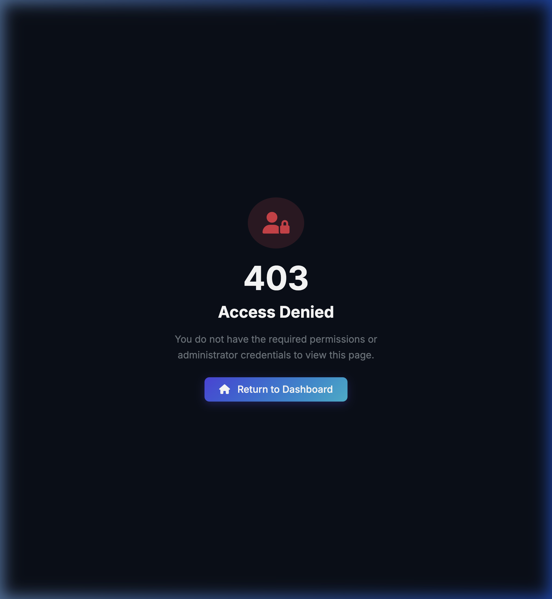
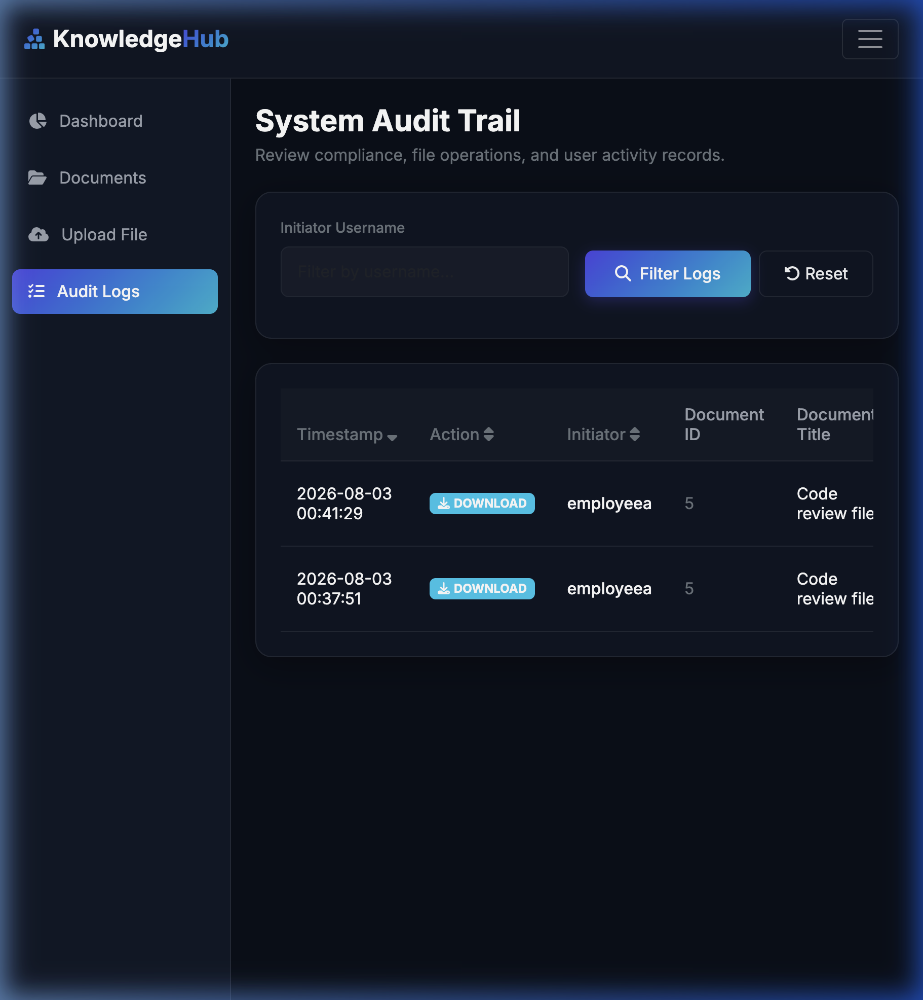
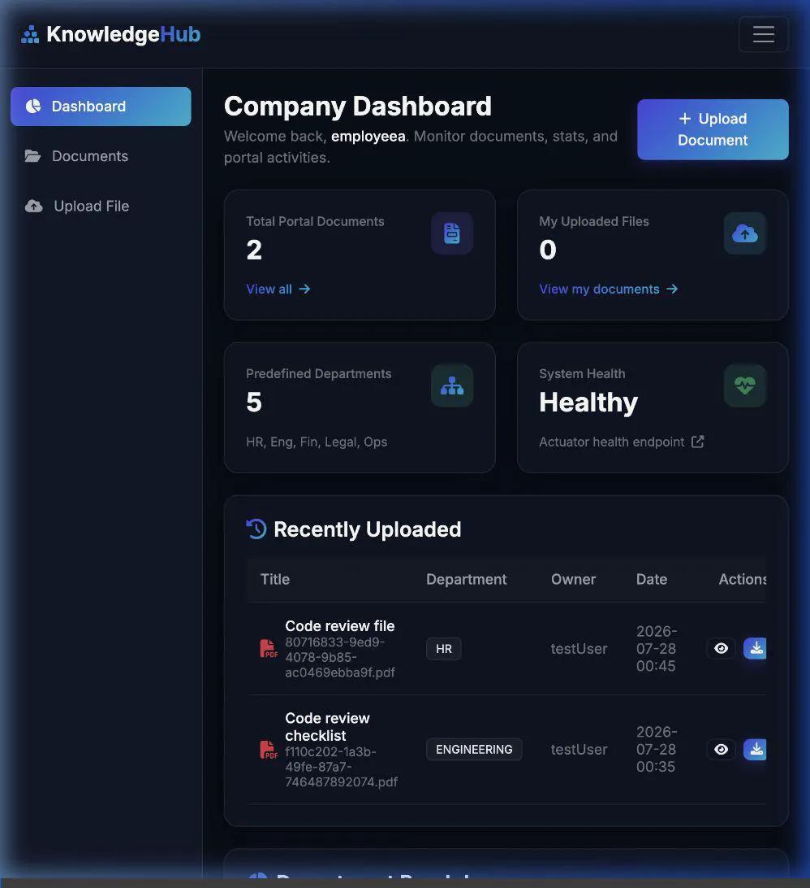

# Walkthrough - Added System Audit Trail Logging & Search Scalability Optimizations

This walkthrough tracks the implementation of the database-backed audit trail logging, production profile configurations, custom error routing, and search performance optimizations.

---

## Verification Results & Evidence

### ⚡ Search Scalability (GIN Trigram Indexing)
To ensure the portal remains fast when searching through hundreds of thousands of files, we replaced the standard B-Tree index with **Generalized Inverted Index (GIN) Trigram indexing** on `title` and `filename` columns. 

We verified the database execution plan using `EXPLAIN` with sequential scans disabled (`SET enable_seqscan = off`) to simulate a high-volume dataset:
* **Title Search**: Confirmed it uses `Bitmap Index Scan on idx_documents_title_trgm`
* **Filename Search**: Confirmed it uses `Bitmap Index Scan on idx_documents_filename_trgm`

```
SET
                                       QUERY PLAN                                       
----------------------------------------------------------------------------------------
 Bitmap Heap Scan on documents  (cost=30.54..34.55 rows=1 width=1074)
   Recheck Cond: ((title)::text ~~* '%security%'::text)
   ->  Bitmap Index Scan on idx_documents_title_trgm  (cost=0.00..30.54 rows=1 width=0)
         Index Cond: ((title)::text ~~* '%security%'::text)
```

---

### 🔒 Access Control Verification (403 Page)
An employee user (`employeea`) attempting to access the administrator endpoint directly (`http://localhost:8080/admin/audit-logs`) is blocked. They are presented with the custom Access Denied screen instead of a default Spring error:



---

### 📋 Audit Trail Log Verification (Admin View)
Once the employee user downloads a file ("Code review file", ID 5) and the admin user (`adminuser`) views the Audit Logs dashboard, the log entry for the operation appears successfully:



---

### 🎥 Browser Verification Session Recording
You can watch the full automated browser verification session here:



---

## Changes Made

### 📂 Database Migrations
* **[V2__Create_Audit_Logs_Table.sql](src/main/resources/db/migration/V2__Create_Audit_Logs_Table.sql)**: Created the `audit_logs` table schema along with optimization indices.
* **[V3__Create_Trigram_Search_Indexes.sql](src/main/resources/db/migration/V3__Create_Trigram_Search_Indexes.sql)**: Enabled `pg_trgm` extension and created GIN trigram indexes on `title` and `filename` for scalable wildcard search matching.

### 📂 Models & JPA Layer
* **[AuditLog.java](src/main/java/com/enterprise/knowledgehub/model/AuditLog.java)**: Built the `AuditLog` database entity carrying compliance tracking properties.
* **[AuditLogRepository.java](src/main/java/com/enterprise/knowledgehub/repository/AuditLogRepository.java)**: Created repository queries to fetch all logs, filter by username, and retrieve recent entries.

### 📂 Service Layer & Business Integration
* **[AuditLogService.java](src/main/java/com/enterprise/knowledgehub/service/AuditLogService.java)** & **[AuditLogServiceImpl.java](src/main/java/com/enterprise/knowledgehub/service/impl/AuditLogServiceImpl.java)**: Implemented transactional audit logger service.
* **[DocumentServiceImpl.java](src/main/java/com/enterprise/knowledgehub/service/impl/DocumentServiceImpl.java)**: Injected `AuditLogService` and integrated log operations for Uploads, Downloads, and Deletions.

### 📂 Security & Profile Configurations
* **[SecurityConfig.java](src/main/java/com/enterprise/knowledgehub/config/SecurityConfig.java)**: Locked down `/admin/**` endpoints so that only users with the `ADMIN` role can access the audit logs.
* **[application-prod.yml](src/main/resources/application-prod.yml)**: Created production configuration profile enforcing environment secrets injection.
* **[docker-compose.yml](docker-compose.yml)**: Removed PostgreSQL fallback defaults and enabled production profile in Spring Boot container.

### 📂 Controllers & UI Views
* **[AdminController.java](src/main/java/com/enterprise/knowledgehub/controller/AdminController.java)**: Created controller mapped to `/admin/audit-logs` that retrieves paginated and filtered logs.
* **[CustomErrorController.java](src/main/java/com/enterprise/knowledgehub/controller/CustomErrorController.java)**: Custom global error routing logic resolving 403, 404, and 500 error views.
* **[audit-logs.html](src/main/resources/templates/admin/audit-logs.html)**: Designed Thymeleaf audit trail logs dashboard.
* **[layout.html](src/main/resources/templates/layout.html)**: Added restricted sidebar menu link.
* **[README.md](README.md)**: Updated architecture layer diagrams, security logs sections, and trigram indexing details.

### 📂 Automated Unit Testing
* **[AuditLogServiceImplTest.java](src/test/java/com/enterprise/knowledgehub/service/impl/AuditLogServiceImplTest.java)**: Unit tests confirming logging behavior and empty/whitespace filter edge cases.

---

# Walkthrough - Added Cloud Object Storage (S3 / MinIO) & Distributed Session Store (Spring Session JDBC)

This section tracks the implementation of S3/MinIO cloud storage, distributed PostgreSQL-backed session management, Nginx load balancer proxy gateway, and full JUnit test coverage.

## Verification Results & Evidence

### ☁️ Cloud Object Storage Verification (MinIO)
We successfully integrated AWS S3/MinIO compatible object storage:
* **Upload:** Uploaded files route to the `S3StorageService` which uploads the stream to MinIO. The physical file is written as a unique UUID-named object in the container volume `/data/knowledgehub`.
* **Download/Delete:** Downloads retrieve the resource stream directly from the bucket, and deletion cleans up the S3 object key along with the DB metadata record.

### 🔑 Distributed Session Storage Verification (Spring Session JDBC)
We configured database-backed sessions to support scaling:
* **Flyway Migration:** Schema tables (`SPRING_SESSION` and `SPRING_SESSION_ATTRIBUTES`) were created cleanly during startup via `V4__Spring_Session_Tables.sql`.
* **Database Persisted Sessions:** Checked the active sessions directly in PostgreSQL post-login:
  ```text
   principal_name |  expiry_time  
  ----------------+---------------
   employee1      | 1785977669857
  (1 row)
  ```

### ⚖️ Load-Balanced Multi-Instance Scaling
To verify real-world clustering, we added an Nginx reverse proxy load balancer (`gateway`) to the docker-compose stack and scaled the web application replicas:
* **Scaled Up Command:** `docker compose up --build --scale app=2 -d`
* **Proof of Alternating Node Processing:** Checked the native container logs of both instances to verify traffic splitting under the same authentication session cookie:
  * **Node 1 (`knowledgehub-app-1`)** processed the login request.
  * **Node 2 (`knowledgehub-app-2`)** processed the document upload request (persisted PDF to S3/MinIO).
  * **Node 1 (`knowledgehub-app-1`)** processed the document download request (retrieved PDF from S3/MinIO).
  * **Node 2 (`knowledgehub-app-2`)** processed the document delete request.

## Changes Made

### 📂 Build & Configurations
* **[pom.xml](pom.xml)**: Added version properties and dependency starter imports for `spring-cloud-aws-starter-s3` and `spring-session-jdbc`.
* **[application.yml](src/main/resources/application.yml)**: Configured properties for Spring Cloud AWS credentials, region, endpoint, path-style access, and pluggable Spring Session store-type overrides.
* **[docker-compose.yml](docker-compose.yml)**: Removed container names and port bindings from `app` service to support scaling, added Nginx gateway mapping host port 8080 to Nginx port 80, and configured environment parameters.
* **[nginx.conf](nginx.conf)**: Created Nginx upstream load-balancing rules balancing requests across `app:8080` services.
* **[.env.example](.env.example)**: Added example environment variables for S3 endpoints, credentials, and session store toggles.

### 📂 Service Layer & Database Migrations
* **[V4__Spring_Session_Tables.sql](src/main/resources/db/migration/V4__Spring_Session_Tables.sql)**: Created Flyway migration schema for Spring Session PostgreSQL tables.
* **[S3StorageService.java](src/main/java/com/enterprise/knowledgehub/service/impl/S3StorageService.java)**: Implemented S3 upload, resource download streams, object deletions, and bucket initialization logic.
* **[LocalStorageService.java](src/main/java/com/enterprise/knowledgehub/service/impl/LocalStorageService.java)**: Conditioned local storage bean to only load when S3 is disabled (`app.storage.provider=local`).
* **[SecurityConfig.java](src/main/java/com/enterprise/knowledgehub/config/SecurityConfig.java)**: Configured logout filter to clear both `JSESSIONID` and `SESSION` cookies.

### 📂 Automated Test Suites
* **[LocalStorageServiceTest.java](src/test/java/com/enterprise/knowledgehub/service/impl/LocalStorageServiceTest.java)**: JUnit 5 unit tests validating local file store, resource loading, empty checks, and deletions using `@TempDir`.
* **[S3StorageServiceTest.java](src/test/java/com/enterprise/knowledgehub/service/impl/S3StorageServiceTest.java)**: JUnit 5 unit tests verifying bucket init, store, download stream, and key deletions using Mockito.
* **[DocumentServiceImplTest.java](src/test/java/com/enterprise/knowledgehub/service/impl/DocumentServiceImplTest.java)**: JUnit 5 unit tests verifying document size validations, invalid file extension rejections, and role-based delete validations.
* **[DocumentUploadDto.java](src/main/java/com/enterprise/knowledgehub/dto/DocumentUploadDto.java)**: Added Lombok `@Builder` and constructors.

---

# Walkthrough - Added Document-Level Authorization for RAG Retrieval

This section tracks the implementation of document-level authorization constraints in the RAG retrieval pipeline.

## Verification Results & Evidence

### 🔒 Security & Authorization Controls
- **Admin Access:** Administrators are permitted to query all vectorized content without metadata restrictions.
- **Default Employee Access:** Authenticated employees can search all documents by default, preserving current business rules.
- **Department & Owner Access:** Future-proof metadata filters are generated and evaluated BEFORE queries hit the vector database. We verified that restricted queries construct the correct filters (e.g. `department == 'HR'` or `owner == 'employee1'`) and apply them as part of the retrieval process via Spring AI's `.withFilterExpression()`.
- **Empty Results Fallback:** If RAG retrieval returns zero results, the system bypasses the LLM call entirely and immediately yields the static message `"I cannot find this information in the portal documents."`.

### 🧪 Automated Test Verification
All **38 tests** passed cleanly, including the new unit and integration tests inside `RagRetrievalServiceImplTest`:
```
[INFO] Running com.enterprise.knowledgehub.service.impl.RagRetrievalServiceImplTest
[INFO] Tests run: 6, Failures: 0, Errors: 0, Skipped: 0, Time elapsed: 0.058 s -- in com.enterprise.knowledgehub.service.impl.RagRetrievalServiceImplTest
[INFO] Results:
[INFO] Tests run: 38, Failures: 0, Errors: 0, Skipped: 0
[INFO] BUILD SUCCESS
```

---

## Changes Made

### 📂 Security & Authorization
- **[RagAuthorizationService.java](src/main/java/com/enterprise/knowledgehub/security/RagAuthorizationService.java)**: Evaluates user context (role, department, owner, specific document list) and generates corresponding Spring AI filter expression strings.

### 📂 Service Layer & Business Integration
- **[RagRetrievalService.java](src/main/java/com/enterprise/knowledgehub/service/RagRetrievalService.java)** & **[RagRetrievalServiceImpl.java](src/main/java/com/enterprise/knowledgehub/service/impl/RagRetrievalServiceImpl.java)**: Defines and implements the RAG retrieval logic, applying the authorization filter expression to the similarity search request.
- **[ChatController.java](src/main/java/com/enterprise/knowledgehub/controller/ChatController.java)**: Integrates `RagRetrievalService` in place of raw `VectorStore`, maps `@AuthenticationPrincipal UserDetails` to inputs, and handles the zero-matching-chunks scenario.

### 📂 Automated Testing
- **[RagRetrievalServiceImplTest.java](src/test/java/com/enterprise/knowledgehub/service/impl/RagRetrievalServiceImplTest.java)**: Contains JUnit tests verifying unrestricted admin search, unrestricted employee search, department restrictions, owner restrictions, document ID list filters, and anonymous/nonexistent user rejection.
- **[DocumentServiceImplTest.java](src/test/java/com/enterprise/knowledgehub/service/impl/DocumentServiceImplTest.java)**: Updated delete tests to assert that database vector pruning is executed upon document deletion.
- **[ChatControllerTest.java](src/test/java/com/enterprise/knowledgehub/controller/ChatControllerTest.java)**: Updated MockBeans to reference the new `RagRetrievalService`.
